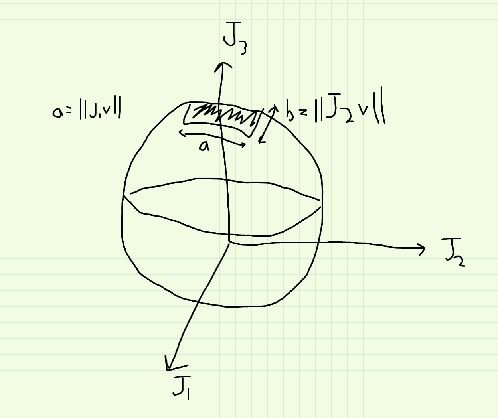
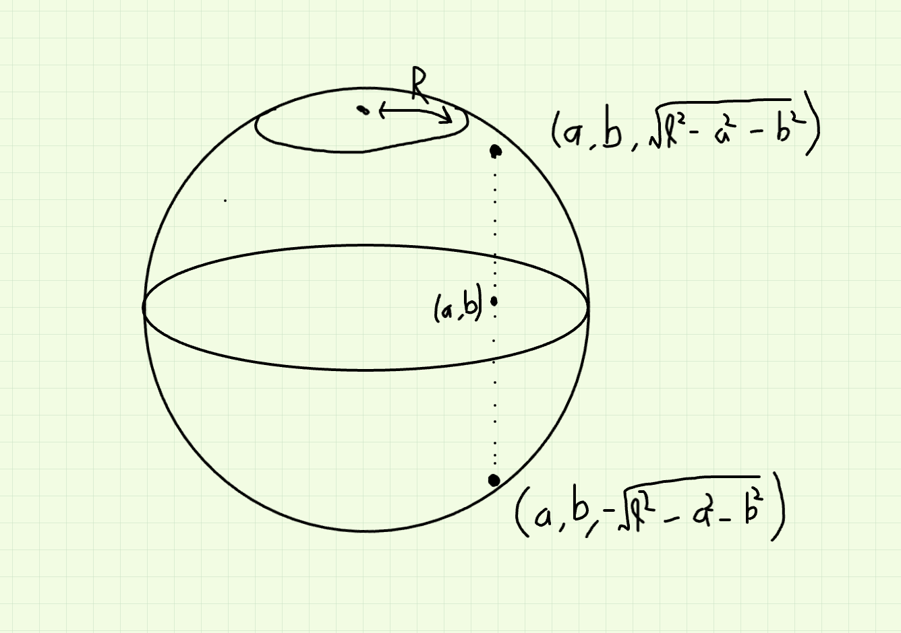
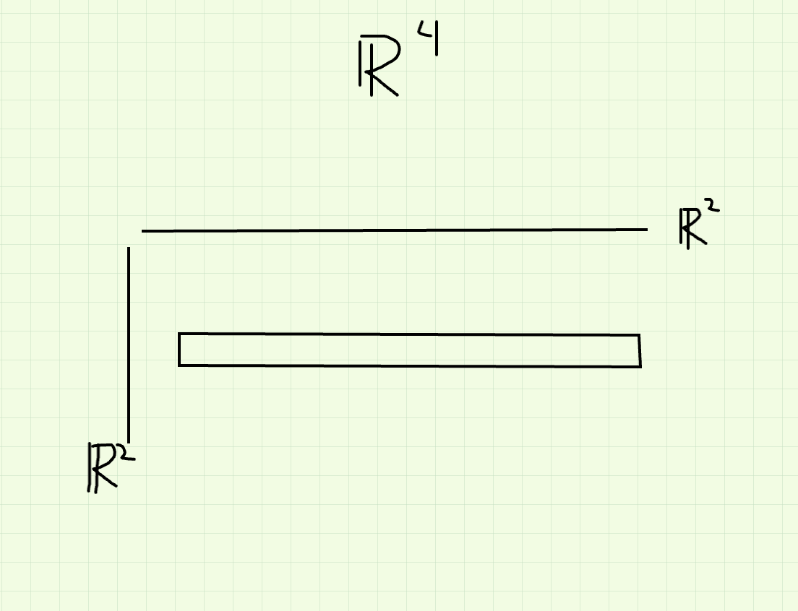

# Some Remarks on Microlocal Analysis of Lie Group Representations

Status: In progress

# Introduction to Localization

## Microlocal Analysis on Representations

What is the meaning of microlocal? The term first originated in the 1970s, in the context of Fourier analysis on $\mathbb{R}^n$ and referred to the process of taking $\sum f_i := f \in L^2(\mathbb{R}^n)$ where both $f_i$ and $\hat{f_i}$ are localized. We want to do the same thing for a vector $v$ in a unitary representation $\pi$ of a Lie group $G$. 

<aside>
💡 As we will see later, when $G$ is the Heisenberg group, and $\pi = L^2(\mathbb{R}^n)$ , the second notion recovers the first one.

</aside>

Outline

1. Localized Vectors
2. Properties & Examples
3. Op-calculus : producing and manipulating localized vectors

We first focus on $G = \mathrm{SO}(3)$. There's one irreducible representation of each odd dimension $(2\ell + 1)$ realized as the space of "spherical harmonics'' :

$$
V_\ell := \{ \text{ polynomials } P \text{ on } \mathbb{R}^3 \text{ of degree } \ell : \Delta P = 0\} .
$$

There is a natural action of $g$ by $g. P(x,y,z) = P((x,y,z)g)$ and norm given by integrating the square over the sphere $S^2$.  

Examples

- $\ell = 1$, $V_\ell = \mathrm{span}\{x,y,z\}.$
- $\ell = 2$, $V_\ell = \mathrm{span}\{xy, yz, zx, x^2-y^2, y^2-z^2\}$.

In the standard basis, we can diagonalize $R_\theta^{(z)} :=$ rotation by $\theta$ around $z$-axis giving 

$$
V_1 = \begin{cases} x+iy & e^{i\theta} \\ z & \text{ invariant } \\ x-iy & e^{-i\theta} \end{cases}
$$

and

$$
V_2 = \begin{cases} 
(x+iy)^2 & e^{-2i\theta} \\ 
(x+iy)z & e^{-i\theta} \\
x^2 + y^2 - 2z^2 & \text{ invariant } \\
(x-iy)z & e^{i\theta} \\
(x-iy)^2 & e^{2i\theta}.
\end{cases}
$$

We denote the Lie algebra as 

$$
\mathrm{Lie}(\mathrm{SO}_3) = \{ X \in M_3 : X + X^T = 0\} \\
= \begin{bmatrix} 0 & -z & y \\ z & 0 & -x \\ -y & x & 0 \end{bmatrix} =: xJ_1 + yJ_2 + zJ_3.
$$

So for instance, $J_3 = \begin{bmatrix} 0 & -1 & \\ 1 & 0 & \\ & & 0 \end{bmatrix}$ represents infinitesimal rotation around $z$-axis. We have the following commutation relations 

$$
[J_1, J_2] = J_3, \ [J_2, J_3] = J_1, \ [J_3, J_1] = J_2.
$$

The basis $Y_m^\ell$ of spherical harmonics for $V_\ell$ diagonalizees the action of $J_3$ by $J_3(Y_m^\ell) = (-im)Y_m^\ell$. In this sense, these are the weight vectors for the action of $\mathrm{SO}(3)$. For example, this basis is given in the second example for $V_2$, i.e. $Y_2^2 = (x+iy)^2$, $Y_1^2 = (x+iy)z$, $\dots$ etc. Although $Y_m^\ell$ gives an explicit basis, the action of $\mathrm{SO}(3)$ is generally complicated ; only the $z$-axis rotations are easy. One thing in particular we'd like to understand is the matrix coefficients $\langle g Y_m^\ell, Y_{m'}^\ell\rangle$.

<aside>
💡 Exercise : One can show that for fixed $g \in \mathrm{SO}(3)$, $g \neq 1$ and $g$ not a $z$-axis rotation, that $\langle gY_\ell^\ell, Y_\ell^\ell \rangle$ decays exponentially in $\ell$, but that this is not the case for $Y_0^\ell$.

</aside>

The action of elements in the complexified Lie algebra is also interesting. Write $J_z = iJ_3$, $J^\pm = i(J_1 \pm iJ_2) \in \mathrm{Lie}(G) \otimes \mathbb{C}$. Then

$$
J_z \cdot Y_m = m Y_m \\ 
J^+ \cdot Y_m = \left(\sqrt{(\ell + 1/2)^2 - (m+1/2)^2}\right) Y_{m+1} \\
J^- \cdot Y_m = \left(\sqrt{(\ell + 1/2)^2 - (m+1/2)^2}\right) Y_{m-1}.
$$

Next we can talk about characters $\chi_{V_\ell}(g)$ which is just the trace of $g$ acting on $V_\ell$. Any $g$ is conjugate to a $z$-axis rotation, and since the character is a class function, we might as well take $g = R_\theta^{(z)}$ for some $\theta$. So we know that $\chi_V(g)$ is the sum of the eigenvalues and hence 

$$
\chi_{V_\ell}(g) = e^{-i\ell \theta} + \dots + e^{i\ell \theta} = \frac{e^{i(\ell + 1/2)\theta} - e^{-i(\ell + 1/2)\theta}}{e^{i\theta/2} - e^{-i\theta/2}}.
$$

In the 1960s, Kirillov observed that $\hat{\chi_V}$ looks "very nice''. First, we can consider $\chi_V$ as a function on $\mathrm{Lie}(G)$ by $X \mapsto \chi_V(\exp X)$. In this case 

$$
\chi_{V_\ell}(\exp X) = (\text{ same formula) with } \theta = \sqrt{x^2 + y^2 + z^2},
$$

where $x,y,z$ are the Lie algebra coordinates of $X = \begin{bmatrix} 0 & -z & y \\ z & 0 & -x \\ -y & x & 0 \end{bmatrix}$. Pulling back by $X \mapsto \exp(X)$ doesn't preserve measure, but it has a nontrivial Jacobian : $d(\exp X) = j(X) \,dX$. In our case, $J(X) = \left(\frac{e^{i\theta/2} - e^{-i\theta/2}}{i\theta}\right)^2.$

### Kirillov

Consider 

$$
\sqrt{j(X)} \chi_{V_\ell}(\exp X) = \left[\frac{e^{i(\ell + 1/2)\theta} - e^{-i(\ell + 1/2)\theta}}{i\theta}\right], \ \theta = \sqrt{x^2 + y^2 + z^2},
$$

(so that we think of $\theta$ as the "radius'' on $\mathrm{Lie}(\mathrm{SO}_3).)$ Then 

$$
\sqrt{j}\chi_{V_\ell}(e^X) = \left(\text{ Fourier transform of sphere w/ radius } \ell + \frac{1}{2}\right) \times \frac{1}{2\pi(\ell + 1/2)}.
$$

This is Kirillov's form of the character formula for $\mathrm{SO}(3).$ By the Fourier transform, we really mean the FT of the area measure on the sphere, i.e. 

$$
\hat{\mu_S}(k) = \int_{S^2} e^{ikx}\,dx. 
$$

In fact, the same assertion holdes for any compact $G$ and any $\pi$, i.e. 

$$
\sqrt{j(X)}\chi_\pi(e^X) = \text{ Fourier transform } \left(G\text{-invariant measure on a } G\text{-orbit } \mathcal{O}_\pi \text{ in } \mathrm{Lie}(G)^\ast\right).
$$

That this holds for nilpotent $G$ as well is due to Kirillov and reductive $G$ and tempered $\pi$ is due to Rossman. $\mathcal{O}_\pi$ is called the coadjoint orbit attached to $\pi$. Evaluating the Kirillov formula at $X = 0$ tells us that 

$$
2\ell + 1 = \int_{S^2} \,dx,
$$

i.e. that the area of the sphere is equal to the dimension of the representation. This suggests that the existence of a partition of $\mathcal{O}_\pi = S^2$ into $2\ell + 1$ pieces with a basis element corresponding to each piece. In other words, we'd like to divide $\mathcal{O}_\pi$ into balls $B_i$, each of area $1$ and centered at $\lambda_i \in \mathrm{Lie}(G)^\ast$ and a basis $v_i$ of $V_\ell$ indexed by $B_i$. *Moreover*, for each $X \in \mathrm{Lie}(G)$, we'd like to demand 

$$
X \cdot v_i \approx i \langle X, \lambda_i \rangle v_i,
$$

i.e. $v_i$ is an approximate eigenvector. This would explain why the Kirillov formula is at least approximately correct, for then we would have that the trace of $e^X$ is given by 

$$
\sum_{\lambda_i} e^{i \langle \lambda_i, X \rangle} \approx \int_{\mathcal{O}_\pi} e^{i \langle \lambda, X \rangle},
$$

which becomes closer to the truth as the dimension of the representation goes to infinity. 

<aside>
💡 We say $v \in V_\ell$ is $R$*-localized* at $\lambda \in \mathrm{Lie}(G)^\ast$ if 
$||X v - i \langle \lambda, X \rangle v || \leq R ||v||$ for all $X \in \{J_1, J_2, J_3\}$. In general, we might demand that $X$ stay in some fixed compact set.

</aside>

Since the eigenvalues of $J_i$ are between $-\ell, \dots, \ell$, the above condition is only useful when $R = o(\ell)$. This definition only controls one derivative. To talk about fourier transforms, we need a stronger notion. For many purposes, the following is a better definition. 

We say that $v \in V_\ell$ is $R$-localized to order $N$ if for $\bar{X} := X - i \langle \lambda, X \rangle$, we have 

$$
||\bar{X}_1 \cdots \bar{X}_k v|| \leq R^k ||v||, \text{ for any } k \leq N.
$$

<aside>
💡 The highest weight vector $Y_\ell^\ell$ is $\sqrt{6\ell}$-localized to order $3$.

</aside>

Note that functions in $V_\ell$ restricted to $S^2$ forms an $\ell(\ell+1)$ eigenspace for $\Delta_{S^2}$. In fact, $-(J_1^2 + J_2^2 + J_3^2)$ is the Casimir operator which acts by $\ell(\ell+1)$ on $V_\ell$. It has to act by a scalar by Schur's lemma. 

### Limits to Localization

A vector cannot be $R$-localized if $R < 1/2\sqrt{\ell}$. For instance, $Y_\ell^\ell$ is most localized and lives in a cap on top of the sphere of radius $\approx \sqrt{\ell}$. 

Before we prove this, it's easier to first see that a vector cannot be $0$-localized, i.e. cannot be a common eigenvector for $\mathrm{Lie}(G)$. Indeed if $J_1 v \propto v$, then $[J_i, J_j]$ would kill $v$, which implies $J_i v = 0$ for all $i$. 
Now to prove the first thing, without loss of generality let's take $\lambda = (0,0, \ell+1/2)$. Let $a = ||J_1v||, b = ||J_2v||$ where $||v|| = 1$. 

<aside>
💡 Claim : $ab + \frac{1}{\ell}a^2 + \frac{1}{\ell}b^2 \geq \frac{\ell(\ell+1)}{2}$ $\implies$ either $a$ or $b > \sqrt{\ell}/2$.

</aside>

Proof : We will compute $||J_3v||$ in two different ways. First we see that $||J_3 v|| = ||[J_1, J_2]v||$. We already have that 

$$
||J_3v||^2 = \ell(\ell+1) - ||J_1v||^2 - ||J_2v||^2  = \ell(\ell+1) - a^2 - b^2. 
$$

On the other hand, 

$$
||J_3v||^2 = \langle [J_1, J_2]v, J_3 v\rangle = \langle (J_1 J_2 - J_2J_1 )v, J_3v\rangle  \\ = \langle J_1J_2v, J_3v\rangle + \langle -J_2J_1v, J_3v\rangle \\
= \langle J_2v, -J_1J_3v \rangle + \langle J_1v, J_2J_3v\rangle \\
= \langle J_2v, -J_3J_1v\rangle + \langle J_2v, J_2 v \rangle + \langle J_1v, J_3J_2v\rangle + \langle J_1v, J_1v \rangle \\
\overset{\text{Cauchy--Schwarz}}{\leq} \ell ab + b^2 + \ell ab + a^2 = 2\ell a b + a^2 + b^2 .
$$

So we obtain that 

$$
\ell(\ell+1) - a^2 - b^2 \leq 2\ell ab + a^2 + b^2 \implies a \text{ or } b \gg O(\sqrt{\ell}).
$$

Interpretation : Roughly our inequality says $ab \gtrsim \ell$, which if we think of our vector in coordinates, it gives a lower bound on the area of something $v$ is allowed to be localized. 

### Interlude : The Heisenberg Group

Take $L^2(\mathbb{R})$ and define the operators $T_x : f(t) \mapsto f(t+x)$ and $M_y : f(t) \mapsto e^{ity}f(t)$. They satisfy $T_xT_{x'} = T_{x + x'}$ and $M_y M_{y'} = M_{y + y'}$. Also $(T_xM_y f) = e^{ixy}(M_y T_x f)$. SO these two groups generate a "3 dimensional'' group and gives a rep of $\begin{bmatrix} 1 & x & z \\ & 1 & y \\ & & 1\end{bmatrix}$ on $L^2(\mathbb{R})$ via 

$\begin{bmatrix} 1 & x & z \\ & 1 & y \\ & & 1\end{bmatrix}$ acts on $L^2(\mathbb{R})$ as $e^{iz}T_xM_y$. This is the Heisenberg group. The Lie algebra action is given by 

$$
Xf(t) = \frac{\,df}{\,dt}, \ Yf(t) = itf(t), \ Zf(t) = i f(t). 
$$

To be localized, we should have $Xf \approx i \lambda_x f$ and $Yf \approx i \lambda_y f$. So to be $R$-localized, we demand 

$$
||itf(t) - \lambda_yf(t)|| \leq R, \ ||f|| = 1, 
$$

i.e. $\int (t-\lambda_y)^2 |f|^2 \leq R$, i.e. most of the "mass'' of $|f|^2$ is within $O(\sqrt{R})$ of $t = \lambda_y$. For $Xf$ to be $R$-localized, we look instead at the Fourier transform so that the condition reads 

$$
||k \hat{f}(k) - \lambda_x \hat{f}|| \leq R, \ ||\hat{f}|| = 1,
$$

i.e. $\int (k-\lambda_x)^2 |\hat{f}|^2 \leq R$, i.e. most of the mass of $|\hat{f}|^2$ is within $O(\sqrt{R})$ of $\lambda_x$. 

<aside>
💡 The property that $\left[\int(k-k_0)^2|\hat{f}|^2 \right]\left[\int (x-x_0)^2|f|^2 \right] \geq C$ for $C$ an absolute constant, is the analogue of $ab \gtrsim \ell$.

</aside>

### Properties of Localized Vectors

If $v_i$ and $v_j$ are $R$-localized at $\lambda_i, \lambda_j$ and $\lambda_i \neq \lambda_j$, then they are $\approx$ orthogonal. Indeed for $X \in \mathrm{Lie}(G)$, $\langle Xv_1, v_2 \rangle + \langle v_1, X v_2 \rangle = 0$, but the LHS is the same as 

$$
i \langle \lambda_1, X\rangle \langle v_1, v_2\rangle - i \langle \lambda_2 , X \rangle \langle v_1, v_2 \rangle + O(R) \implies \langle v_1, v_2 \rangle = O\left(\frac{R}{|\lambda_1 - \lambda_2|}\right). 
$$

Thinking of $R \sim \sqrt{\ell}$, then this is $O(\ell^{-1/2})$ which is basically orthogonal. If we instead had $R$-localization to order $N$, then we'd get $O\left(\frac{R}{|\lambda_1 - \lambda_2|}^N\right)$.  This brings us back to the example of the decay of $\langle g Y_\ell^\ell, Y_\ell^\ell \rangle$. The point is somehow if $g$ doesn't stabilize $Y_\ell^\ell$, then these vectors are approximately orthogonal. 

Rephrasing, if $v_1 \otimes v_2 \in \pi \otimes \overline{\pi}$ is localized at $(\lambda_1, \lambda_2) \in \mathrm{Lie}(G)^\ast \times \mathrm{Lie}(G)^\ast$, then $\langle v_1, v_2 \rangle$ is negligible unless $|\lambda_1 - \lambda_2| = O(R^{1+\epsilon})$. More generally, if $v \in \pi$ is localized at $\lambda$ and $\ell : \pi \to \mathbb{C}$ is invariant by $H \subseteq G$, then $\ell(v)$ is negligible unless $\lambda$ is near $\mathrm{Lie}(H)^\perp$. 

Note there are only $O(1)$ vectors that are $O(\sqrt{\ell})$-localized at a given $\lambda$. We can see this in the bassis $Y_m^\ell$. Without loss of generality, suppose $v$ is localized at $(0,0, \ell+1/2)$ and $v = \sum c_m Y_m^\ell$. Then this has most of the mass $\sum |c_m|^2$ coming from $m = \ell + O(1)$. 

Any $R$-localized vector, a condition which only requires one derivative, is $L^2$-close to an $R^{1+\epsilon}$-localized vector to order $N$, i.e. vectors that are $R$-localized up to many derivatives.

As an example consider the top weight vector $Y_\ell^\ell$ which is very localized. We can add a small perturbation via the middle weight vector and call the result $Y := Y_\ell^\ell + \frac{1}{\sqrt{\ell}}Y_0^\ell.$ This thing is $R$-localized because the impact of the $Y_0^\ell$ is fairly small, but it is not $R$-localized to order $N$ as the impact of $Y_0^\ell$ becomes worse as you are allowed to take more derivatives. However, $Y$ is $L^2$-close to a localized vector of order $N$, namely $Y_\ell^\ell$ , since the $L^2$-norm of $\frac{1}{\sqrt{\ell}} Y_0^\ell$ is so small. 

In other words, for every $R$-localized unit vector $v$, there is an $R^{1+\epsilon}$-localized to order $N$ vector $v^\ast$ such that 

$$
||v - v^\ast|| \leq 0.001.
$$

We'll see in the proof exactly how small we can make this $L^2$-norm. So how do we prove this? We think of this in analogy with functions. If we had some function with controlled first derivative, we'd try to get control over higher derivatives by smoothing it. And to smooth it we could imagine convolving with a kernel that sort of gets rid of higher frequencies. To this end, we construct $v^\ast$ as 

$$
v^\ast = \int_{Y \in \mathrm{Lie}(G)} \varphi_{R^{1+\epsilon}}(Y)\left(e^{\overline{Y}}v\right)\,dY,
$$

where $\varphi$ is a smooth bump function on $\mathrm{Lie}(G)$ so that $\varphi(x) = 1$ in a neighborhood of zero and $\int \varphi = 1$. Moreover, we write $\varphi_T(x) := \varphi(Tx)\cdot T^{\dim G}.$ Since $\overline{X}$ approximately kills $v$, $e^{\overline{X}}$ approximately stabilizes v. But we only have this kind of control for certain Lie algebra elements, hence the need for the cutoff function $\varphi.$ With this setup, the integral is supported on $Y = O(R^{-1-\epsilon}).$ Now we just need to prove that $v^\ast$ is $R^{1+\epsilon}$-localized to order $N$. 

Proof : For $Y \in \mathrm{Lie}(G)$ we have

$$
e^{\overline{Y}}v - v = \int_0^1 \frac{\,d}{\,dt}\left(e^{t\overline{Y}}v\right)\,dt = \int_0^1 e^{t\overline{Y}}(\overline{Y}v)\,dt.
$$

Taking norms of both sides and using that $e^{t\overline{Y}}$ is unitary, we find that 

$$
||e^{\overline{Y}}v - v|| \leq ||\overline{Y}v|| = O(R||Y||) = O(R^{-\epsilon}),
$$

since $Y = O(R^{-1-\epsilon})$ in the support of the integral. 

The next property to discuss is this seeming phenomenon where you don't have to check localization under all the Lie elements because some come for free (recall the $J_3$ calculation in the $SO(3)$ case. )

So suppose $v$ is $R$-localized to order $N$ for $J_1$ and $J_2$. i.e. 

$$
J_1v \approx iav, \ J_2v \approx ibv, \ R = O(\sqrt{\ell}).
$$

Let's also suppose that $a^2 + b^2 < 0.9\ell^2$. Then $v = v^+ + v^-$ where $v^+$ is localized at $(a,b, \sqrt{\ell - a^2 - b^2})$ and $v^{-}$ is localized at $(a,b, -\sqrt{\ell^2 - a^2 - b^2}).$

Idea: We already know $J_1^2 + J_2^2 + J_3^2 = -\ell(\ell+1)$, so morally speaking once we know $J_1$ and $J_2$, we know $J_3$ up to sign. 
So instead let's write $v$ as a linear combination of localized vectors $\int_{\tau \in \mathcal{O}} v_\tau$ and we will show that only $\tau^+$ and $\tau^{-}$ contribute, where $\tau^+$ and $\tau^-$ are the two points in the picture above. 

The general question is given a vector, how does one write it in terms of localized vectors? The point of the $\mathrm{Op}$-calculus is to give a systematic way to do this. We will show a sort of ad-hoc method for now. To do this, we start with a vector $v_0$ localized at $\lambda_0$. For this step we could take the highest weight vector for instance. To this end, we take 

$$
v = \frac{1}{\dim V_\ell}\int_{g \in G} \langle v, gv_0 \rangle gv_0.
$$

This is generally just the orthogonality of matrix coefficients. We think of the RHS as a map $v \mapsto$ RHS. Then it's clear that this map commutes with $G$ so by Schur's lemma it has to be a scalar multiple of the identity. To compute the scalar correctly, we take the trace and compute it using the character. It's a general principle, to be discussed later, that $gv_0$ is localized at $g.\lambda_0$. Since $\langle v, gv_0\rangle$ is just a scalar, we've indeed written $v$ as a linear combination of localized vectors. 

This is kind of the point of localized vectors in the sense that they are only useful if we can write other vectors in terms of them. This is analogous to the principle of writing arbitrary functions in terms of complex exponentials (Fourier series). 

So, if $v$ is localized for $J_1$, $J_2$ with eigenvalues $a,b$, then 

$$
\langle v, gv_0 \rangle \text{ is negligible unless } g\lambda_0 \approx (a,b,?),
$$

since we know that $v$ is localized at $(a,b,\ast)$, we don't really know the last coordinate yet. And so $gv_0$ has to be localized near the same place in order for this matrix coefficient to not be stupid. Therefore, in the integral, the biggest contribution is from when $g\lambda_0$ is close to $\tau^+$ or $\tau^-$. In other words, 

$$
v = \frac{1}{2\ell+1} \int_{g \lambda_0 \approx \tau^+} \langle v, gv_0\rangle gv_0 + \frac{1}{2\ell+1}\int_{g\lambda_0 \approx \tau^-} \langle v, gv_0\rangle gv_0 + \text{ negligible}.
$$

Note that the central feature we used was that the projection $\mathrm{Lie}(G)^\ast \to \langle J_1, J_2 \rangle^\ast$ is from a $3$-dimensional space to a $2$-dimensional space, so it's not injective. However, if we restrict it to the coadjoint orbit 

$$
\mathcal{O}_{\pi} \to \mathbb{R}^2,
$$

is $2:1$ away from the equator. In general, in higher rank if we find a projection that's $1:1$, it's enough to check localization under a smaller set of things. In other words, if $H \subseteq G$ is such that 

$\mathrm{Lie}(G)^\ast \to \mathrm{Lie}(H)^\ast$ is injective on $\mathcal{O}$, then localization for $H$ implies localization for $G$. This shows that for localization, we don't always need to understand the entire group. This is convenient when working with models like Kirillov or Whittaker model, which privilege a certain subgroup.  

### The area/volume form on $\mathcal{O}$

Vectors cannot be *too* localized near $\lambda$. Recall, we made an argument about commutators last time, and if $v$ were perfectly localized, we'd obtain

$$
0 = [X,Y]v = \langle \lambda, [X,Y]\rangle v,
$$

and the latter defines a volume form, so this can't happen. 

Let $G$ be a Lie group and $\mathcal{O}$ and $G$-orbit on $\mathrm{Lie}(G)^\ast$. Let $\lambda \in \mathcal{O}$ and denote $T_\lambda$ the tangent space to $\mathcal{O}$ at $\lambda$. Then the rule 

$$
X, Y \in \mathrm{Lie}(G) \mapsto \langle \lambda, [X,Y]\rangle,
$$

descends, via the orbit map $\mathrm{Lie}(G) \to T_\lambda$, to a nondegenerate skew symmetric pairing on $T_\lambda$. In other words, we obtain a $2$-form on $\mathcal{O}$. This orbit map is obtained by differentiating the natural map 

$$
G \to \mathcal{O} \\ g \mapsto g . \lambda
$$

So the vector $X \in \mathrm{Lie}(G)$ gets sent to $X. \lambda$, which is in $\mathrm{Lie}(G)^\ast$. So we should have

$$
X.\lambda(Y) = \lambda(-[X,Y]),
$$

where $Y \in \mathrm{Lie}(G)$. Claim says that $\langle \lambda, [X,Y] \rangle$ depends only on $X. \lambda$ and $Y.\lambda$ in $T_\lambda$ and 

$$
X.\lambda , Y.\lambda \to \langle \lambda, [X,Y]\rangle \\
T_\lambda \times T_\lambda \to \mathbb{R},
$$

is nondegenerate. 

<aside>
💡 Example: The $2$-form on $\mathcal{O}$= sphere of radius $\ell + 1/2$ is the Lebesgue area / ($\ell+1/2$).

</aside>

This also kind of explains the scale. Scaling the orbit by $R$ only scales the area measure by $R$ instead of $R^2$, as you'd expect. This is related to the square root limit to localization. 

**Kirillov Formula**

As above, any $\mathcal{O}$ gets a non-degenerate $2$-form $\omega$. (In fact, $\omega$ is closed, i.e. $\,d\omega = 0$). This implies $\omega^{\dim \mathcal{O}/2} := \omega \wedge \omega \wedge \dots \wedge \omega$ is a volume form on $\mathcal{O}$. Then the Kirillov formula says that for any compact $G$ and any irreducible $\pi$, there exists $\mathcal{O}_\pi \subseteq$ $\mathrm{Lie}(G)^\ast$ s.t. 

$$
\chi \cdot \sqrt{j}(e^X) = \left(\text{ volume form } \left(\frac{\omega}{2\pi}\right)^{\dim \mathcal{O}_\pi/2} \text{ on } \mathcal{O}_\pi\right)^\wedge.
$$

So now we can quantify the fact that vectors cannot be *too* localized near $\lambda$. If $\dim \mathcal{O} = 2$, we cannot localize on sets of co-area $\ll 1$. This was the analogue of the condition $ab \gtrsim \ell$. In higher dimensions, this would say like the $\omega$-volume $\ll 1$, but this is not the only constraint! We also need the areas of transverse slices to not be too small either. For example, let's look at the following picture in $\mathbb{R}^4$, which we think of as a piece of a $4$-dimensional orbit. 

Then we cannot localize to a set that looks like this which is very narrow in one direction and very long in the other, even if the volume is one. This is related to a topic people have been studying in symplectic geometry called "symplectic capacity''. See Fefferman's paper "The Uncertainty Principle'' for some related discussions. 

## Op Calculus

Two things we want to do systematically: construct localized vectors and write vectors in terms of localized vectors. This is the point of going through the trouble of developing the $\mathrm{Op}$ calculus. 

To a function $a$ on $\mathrm{Lie}(G)^\ast$, we'll associate $\mathrm{Op}(a) : \pi \to \pi$ for any $G$-representation $\pi$. By the orbit method, we construct a basis $v_i$ for $\pi$, each localized at $\lambda_i$ $\in B_i$, for some small neighborhoods $B_i$. Then essentially $\mathrm{Op}(a)$ should just be 

$$
\mathrm{Op}(a) = \sum_{i} a(\lambda_i) \mathrm{Proj}_{v_i},
$$

i.e. it's diagonal in a basis of localized vectors and acts on $v_i$ with eigenvalue $a(\lambda_i)$. So the actual definition is 

$$
\mathrm{Op}(a) \cdot v = \int_{X \in \mathrm{Lie}(G) , |X| \ll 1} a^\vee(X) \left(e^X \cdot v\right)\,dX.
$$

We should always think of $a$ as a smooth function which looks for instance like a bump function in a ball of radius $O(\ell^{1/2+\epsilon})$. This means the Fourier transform will decay long before you reach the limits of the smooth truncation. 

### Example

$G = S^1 = \mathbb{R}/\mathbb{Z}$, $\mathrm{Lie}(G) = \mathbb{R}$ and consider the irreducible representations $\pi_m : x \in \mathbb{R}/\mathbb{Z} \to e^{2\pi i mx }.$ Then 

$$
\mathrm{Op}(a)v = \left(\int_{x \in \mathbb{R}} a^\vee(x)e^{imx}\,dx \right)v = a(m)v.
$$

So $\mathrm{Op}(a)$ just undoes the Fourier transform, and acts by scalar multiplication. 

Roughly, if $v$ is localized at $\lambda$, we expect

$$
\mathrm{Op}(a) \cdot v \approx \int a^\vee(x) e^{i\langle \lambda, x \rangle } v = a(\lambda)v.
$$

### Example

Suppose $a$ is linear, i.e. $a(\lambda) = \langle \lambda, X \rangle$ for some $X \in \mathrm{Lie}(G)$. Then $\mathrm{Op}(a)$ is just the action of $X$. 

Properties of $a \mapsto \mathrm{Op}(a)$

- $a = 1$ implies that $\mathrm{Op}(a)$ is the identity
- If $a$ is real, then $\mathrm{Op}(a)$ is self-adjoint.
- If $a' = g \cdot a$, then $\mathrm{Op}(a') = g\mathrm{Op}(a)g^{-1}$ where $a'(\lambda) = a(g^{-1}\lambda g).$
- Most importantly
    1. $\mathrm{Op}(a) \mathrm{Op}(b) \approx \mathrm{Op}(ab)$
    2. $\mathrm{trace}_\pi \mathrm{Op}(a) \approx \int_{\mathcal{O}_\pi}(a)$ as long as $\pi$ is irreducible and satisfies the conditions for the Kirillov formula to hold. 
    
    These conditions are most accurate in range when $a$ and $b$ are approximately constant on the localization scale, $(\lambda_i + O(\ell^{1/2}))$, but they are not allowed to oscillate within this range. 
    
- Example : If $G$ is the Heisenberg group and $\pi = L^2(\mathbb{R})$, then $\mathrm{Op}(a)$ is a pseudodifferential operator.

Let's prove that if $v$ is in the image of $\mathrm{Op}(a)$, with $a$ a bump around $\lambda$, then $v$ is localized at $\lambda$. To do this we just need to bound $||\bar{X}v||$. We have

$$
||\overline{X}v|| = ||\overline{X}\mathrm{Op}(a)v|| = || \mathrm{Op}(\overline{X}) \mathrm{Op}(a)v|| = ||\mathrm{Op}(\overline{X} \cdot a)v|| \lesssim ||\overline{X}a||_{L^\infty} = ||\overline{X}||_{L^\infty(B(\lambda,R))} = O(R),
$$

where we think of $\overline{X}$ as the linear function $\tau \mapsto \langle X, \tau - \lambda \rangle.$

# Localization via Classes

This is basically the formalism that appears in Nelson 2021, Sec 14.1. 

Let $T$ be an asymptotic parameter that traverses a sequence $\{T\}$ of positive real numbers tending off to $\infty$. Most quantities $x$ that we consider are " $T$-dependent''. This means there is a map $x : T \mapsto x_T$. We used the word "fixed'' to mean "independent of $T$''. 

We can also consider $T$-dependent sets $X = X_T$ and $T$-dependent elements $x = x_T$. The condition $x \in X$ means $x_T \in X_T$ for all $T$, while $x \not\in X$ means $x_T \not\in X_T$ for all $T$. This notation violates the law of the excluded middle, since we can have $x_T \in X_T$ for some $T$, but not for others. WE can restore that law by passing to subsequences of the sequence of parameters $T$. 

By a *class*, we mean a fixed collection of $T$-dependent sets. We say that a $T$-dependent element lies in a given class if it lies in one of the $T$-dependent sets in the given collection. For example, given a $T$-dependent normed vector space , the class $O(1)$ inside $V$ is defined to consist of all $T$-dependent subsets $S=S_T$ of $V = V_T$ such that there is a fixed $C \geq 0$ so that for all $T$, we have $||v_T|| \leq C$ for all $v_T \in S_T$. 

For a real vector space $V$, recall that the Schwartz space $\mathcal{S}(V)$ consists of all functions whose derivatives decay faster than any polynomial. We denote $V^\wedge := \mathrm{Hom}(V, i\mathbb{R})$  the imaginary dual space so that for $x \in V$ and $\xi \in V^\wedge$, the natural pairing $\langle x, \xi \rangle \in i\mathbb{R}$. The Fourier transform is given by 

$$
\mathcal{S}(V) \to \mathcal{S}(V^\ast) \\ 
f \mapsto f^\wedge  := \left[\xi \mapsto \int_V f(x)e^{-\langle x, \xi \rangle} \,dx\right]
$$

with inverse given by 

$$
f \mapsto f^\vee := \left[x \mapsto \int_{V^\wedge} f(\xi) e^{\langle x, \xi \rangle}\,d\xi\right]
$$

<aside>
💡 Definition: Let $V$ be a real vector space. Let $\alpha = \alpha_T \in V$ and $\beta = \beta_T \in V^\wedge$ be $T$-dependent elements, and let $r = r_T > 0$ be a $T$-dependent positive real. We say that $T$-dependent Schwartz function $f = f_T \in \mathcal{S}(V)$ is an $\alpha$-*modulated bump* on $\beta + O(R)$ if there is a fixed bounded subset $\mathfrak{B}$ of $\mathcal{S}(V)$ and a $T$-dependent element $\phi = \phi_T \in \mathfrak{B}$ so that $f(\beta + x) = e^{\langle x, \alpha \rangle } \phi(\frac{x}{r}).$When $\alpha = 0$, we say simply that $f$ is a bump on $\beta + O(r)$.

</aside>

Let $V$ be a real vector space of fixed dimension, let $\alpha$ and $\beta$ be $T$-dependent elements of $V$ and $V^\wedge$ and let $r > 0$ be a $T$-dependent positive real. Then the following are equivalent for a $T$-dependent element $f$ of $\mathcal{S}(V)$. 

1. $f$ is an $\alpha$-modulated bump on $\beta + O(r)$
2. $r^{-\dim V} f^\wedge$ is a $(-\beta)$-modulated bump on $\alpha + O(1/r).$

Fix a smooth even function $\chi \in C_c^\infty(\mathfrak{g})$, taking the value $1$ in a neighborhood of the origin. Given $a \in \mathcal{S}(\mathfrak{g}^\wedge)$, we denote by $\mathrm{Op}(a)$ the oeprator on $\pi$ given by 

$$
\mathrm{Op}(a) := \int_\mathfrak{g} \chi(x)a^\vee(x)\pi(\exp(-x))\,dx,
$$

with $a^\vee \in \mathcal{S}(\mathfrak{g})$ the inverse Fourier transform of $a$. Let $\tau = \tau_T \in \mathfrak{g}^\wedge$ be a $T$-dependent parameter in the dual Lie algebra. We assume that $\tau = O(T)$, i.e. that the norm of $\tau$ is bounded by a fixed multiple of $T$. For each fixed $\epsilon > 0$, we set

$$
B_{\tau, \epsilon} := \tau + O(T^{1/2+\epsilon}).
$$

<aside>
💡 Definition: We say a $T$-dependent vector $v \in \pi$ is localized at the $T$-dependent element $\tau = \tau_T \in \mathfrak{g}^\ast$ if for each fixed $\epsilon > 0$, there is a $T$-dependent Schwartz function $a = a_T \in \mathcal{S}(\mathfrak{g}^\ast)$ s. t. 
i) $a$ is a bump on $B_{\tau, \epsilon}$
ii) $\mathrm{Op}(a)v \approx v$

</aside>

If $v$ is localized at $\tau$, then one can show that $\mathrm{Op}(a)v \approx v$ for any bump $a$ on $B_{\tau, \epsilon}$ with the property that $a(\xi) = 1$ whenever $\xi = \tau + o(T^{1/2 +\epsilon}).$

Here is a useful criterion for determining whether a vector is localized. 

Let $M$ be a class of $T$-dependent vectors $v \in \pi$ satisfying the following properties :

1. For each $v \in M$ we have $||v|| = T^{O(1)}$
2. For all $u, v \in M$, we have $u + v \in M$. 
3. For all $v \in M$, $c \in \mathbb{C}$ with $c = O(1)$, we have $cv \in M$. 
4. For each fixed $\epsilon > 0$, $x \in \mathfrak{g}$ and each $v \in M$, we have 

$$
xv - \langle x, \tau\rangle v \in T^{1/2+\epsilon}M.
$$

or in other words, the $T$-dependent vector $xv - \langle x, \tau \rangle v$ can be written as $T^{1/2+\epsilon}u$ with $u \in M$. 

Then each $v \in M$ is localized at $\tau$ in the sense of the definition above. 

This follows by combining (Nelson 2021, Lem 14.5, Thm 14.12) with $h = 1/T$. 

<aside>
💡 In practice, only the approximate eigenvector in point 4 will be nontrivial to show, the rest will more or less automatically be true with the classes of vectors we consider in the examples that follow.

</aside>

We will investigate this definition with a number of examples for the groups $\mathrm{SO}(3)$ and $\mathrm{PGL}_2(\mathbb{R})$ in the next section. 

<aside>
💡 We say that an element $\xi \in \mathfrak{g}^\wedge$ is *regular* if its $G$-centralizer has smallest possible dimension. We denote by $\mathfrak{g}_\mathrm{reg}^\wedge$ the subset of regular elements. We say that a $T$-dependent element $\xi = \xi_T$ of $\mathfrak{g}^\wedge$ is *uniformly regular* if $T^{-1}\tau = T^{-1}\tau_T$ lies in some fixed compact subset of $\mathfrak{g}_\mathrm{reg}^\wedge.$

</aside>

Let $\pi = \pi_T$ be a $T$-dependent irreducible unitary representation of $G$. Assume that either 

1. $G$ is reductive and $\pi$ is tempered, or 
2. $G = \mathrm{GL}_n(\mathbb{R})$ and $\pi$ is generic. 

Assume that the infinitesimal character $\lambda_\pi$ of $\pi$ has the property that its rescaling $T^{-1}\lambda_\pi$ lies in a fixed compact collection of infinitesimal characters. Define the $G$-invariant subset $\mathcal{O}_\pi \subseteq \mathfrak{g}^\wedge$, as follows. In the first case (1), let it denote the coadjoint orbit assigned to $\pi$ by the Kirillov formula. In the second case (2), let it denote the preimage of $\lambda_\pi$ \in $\mathfrak{g}^\wedge$ under the natural map. 

Let $\tau = \tau_T \in \mathcal{O}_\pi$ be $O(T)$ and uniformly regular. Then : 

1. There is a unit vector $v = v_T \in \pi$ that is localized at $\tau$
2. Let $v_1, \dots, v_m$ be any $T$-dependent orthogonal collection of unit vectors that are each localized at $\tau$. Then $m \leq T^{o(1)}$. 

### Approximate Projectors

Let $G$ be a fixed real reductive group. Let $\tau$ be a uniformly regular $T$-dependent element of $\mathfrak{g}^\wedge$. We choose coordinates $\xi = (\xi', \xi'')$ on $\mathfrak{g}^\wedge$, where $\xi'$ consists of the directions tangent to $G\cdot \tau$ at $\tau$ and $\xi''$ consists of the perpendicular directions. Thus $\xi'$ has dimension $\dim(G) - \mathrm{rank}(G)$ and $\xi''$ has dimensions $\mathrm{rank}(G)$. 

<aside>
💡 We define the *coin-shaped region* $R_{\tau, \epsilon}$ to be the following class in $\mathfrak{g}^\wedge$:
$R_{\tau, \epsilon} : = \{\tau + \xi : \xi' = O(T^{1/2 + \epsilon}), \xi'' = O(T^\epsilon)\}.$

</aside>

We say that a $T$-dependent element $a$ of $\mathcal{S}(\mathfrak{g}^\wedge)$ is a *bump* on $R_{\tau, \epsilon}$ if there is a fixed bounded subset $\mathfrak{B}$ of $\mathcal{S}(\mathfrak{g}^\wedge)$ and a $T$-dependent element $\phi = \phi_T \in \mathfrak{B}$ so that 

$$
a(\tau + \xi) = \phi\left(\frac{\xi'}{T^{1/2+\epsilon}} , \frac{\xi''}{T^{\epsilon}}\right).
$$

We note that the coin-shaped neighborhood $R_{\tau, \epsilon}$ is a subsclass of the ball $B_{\tau, \epsilon}$ defined earlier. 

Let $\pi = \pi_T$ be a $T$-dependent irreducible unitary representation of $G$. Let $\tau = \tau_T$ be a uniformly regular element of $\mathfrak{g}^\wedge$. Let $v = v_T$ be a $T$-dependent element of $\pi$ that has norm $O(1)$ and is localized at $\tau$. Then for each fixed $\epsilon > 0$, there is a bump $a$ on the coin-shaped region $R_{\tau, \epsilon}$ such that 

$$
\mathrm{Op}(a)v \approx v. 
$$

<aside>
💡 The Fourier transform $a^\vee$ is, up to a normalizing scalar, a $\tau$-modulated bump on the dual coin-shaped region 
$R_{\tau, \epsilon}^\vee = \{x \in \mathfrak{g} : x' \ll T^{-1/2 - \epsilon}, x'' \ll T^{-\epsilon}\}$, where $x = (x', x'')$ are the coordinates dual to $\xi = (\xi', \xi'').$

</aside>

## Localization for Weight Vectors

### The Group SO(3) via Weight Vectors

We start with the Lie Group $\mathrm{SO}(3)$ with Lie algebra $\mathfrak{so}(3)$. The Lie algebra has basis $\{R_1, R_2, R_3\}$ where the element $\exp(\theta R_j)$ is given by rotation around the $j$th axis by angle $\theta$. They satisfy the commutation relations

$$
[R_1, R_2] = R_3, \ [R_2, R_3] = R_1, \ [R_3, R_1] = R_2.
$$

The center of the universal enveloping algebra is generated by the Casimir element 

$$
\Omega = -(R_1^2 + R_2^2 + R_3^2). 
$$

Define the following elements $X, Y$ in the complexified Lie algebra $\mathfrak{so}(3)_\mathbb{C}$

$$
X := R_1 + iR_2, \ \ Y:= -R_1 + iR_2.
$$

Then $X, Y, R_3$ is a basis for $\mathfrak{so}(3)_\mathbb{C}$ satisfying the commutation relations

$$
[X,Y] = 2iR_3,\  \ [iR_3, X] = X, \ \ [iR_3, Y] = -Y.
$$

We also observe that 

$$
R_1 = \frac{X-Y}{2}, \ \ R_2 = \frac{X+Y}{2i}, \\ \Omega = \frac{XY + YX}{2} - R_3^2.
$$

The imaginary dual of the Lie algebra identifies with the space of imaginary triples of real numbers

$$
\mathfrak{so}(3)^\wedge \cong i\mathbb{R}^3.
$$

Let $\pi$ be a complex representation of $\mathrm{SO}(3)$. It can be decomposed into eigenspaces for $R_3$. Since $\exp(2\pi R_3) = 1$, the eigenvalues for the action of $iR_3$ are given by integers: 

$$
\pi = \oplus_{m \in \mathbb{Z}} \pi(m) , \ \ \pi(m):= \{v \in \pi: iR_3v = mv \}.
$$

The $m$ for which $\pi(m)\neq 0$ are called the *weights* of $\pi$. From the commutation relations we see that 

$$
X : \pi(m) \to \pi(m+1), \ \text{ and } Y : \pi(m) \to \pi(m-1).
$$

<aside>
💡 Let $\pi$ be an irreducible unitary representation of $\mathrm{SO}(3)$. Then $\Omega$ acts on $\pi$ by a scalar of the form $\Omega_\pi = \ell(\ell+1)$ for some nonnegative integer $\ell$. This scalar determines the isomorphism class of $\pi$. Moreover, there is a basis $e_{-\ell}, \dots, e_{\ell}$ for $\pi$ on which the Lie algebra acts by the formulas 
$X e_m = (\Omega_\pi - m(m+1))^{1/2}e_{m+1}$
$Ye_{m+1} = (\Omega_\pi - m(m+1))^{1/2}e_m$
$iR_3e_m = m e_m.$
If $\pi$ is unitary then this basis is orthonormal .

</aside>

The integer $\ell$ is called the highest weight of $\pi$. The coadjoint orbit for $\pi$ turns out to be given by the sphere of radius $\ell + 1/2$:

$$
\mathcal{O}_\pi = \{(a,b,c) : a^2 + b^2 + c^2 = (\ell + 1/2)^2\}.
$$

### Localized Vectors

Let $T \to \infty$ be an asymptotic parameter valued in the nonnegative integers and let $\pi$ denote the $T$-dependent representation having highest weight $T$. 

**Example 1**

Let $M$ denote the class of $T$-dependent vectors $v \in \pi$ given in terms of the above basis by $v = \sum a_m e_m$ where the coefficients have the following properties:

$$
a_m = 0 \text{ unless } m =T + O(1) \\
\text{ Each } a_m = O(1).
$$

Then for all $v \in M$ we have 

$$
Xv \in T^{1/2}M \\
Yv \in T^{1/2}M \\
iR_3v - iTv \in T^{1/2}M.
$$

Hence every vector in $M$ is localized at the $T$-dependent element $\tau \in \mathfrak{g}^\wedge$ given by $\tau := (0, 0, iT)$. 

**Example 2**

Let $M$ denote the class of $T$-dependent vectors in $\pi$ of the form $\sum a_m e_m$ with the following properties :

1. $a_m = 0$ unless $m = O(T^{1/2})$
2. The function of $\theta \in \mathbb{R} / \mathbb{Z}$ given by 
$a(\theta) := \sum_n a_n e(n\theta)$ is an $L^2$-normalized bump of width $T^{-1/2}$, in the following sense: for each $\ell, k \in \Z_{\geq 0}$, 

$$

      a^{(\ell)}(\theta) \ll
      T^{1/4 + \ell/2} \left( 1+ \frac{\lVert \theta  \rVert}{T^{-1/2}}
\right)^{-k},
$$

where $a^{(\ell)}$ is the $\ell$th derivative and $||\cdot||$ is the distance to the nearest integer.  Condition number $2$ after Parseval implies that $\sum |a_m|^2 = O(1)$. 

Now take $f \in C_c^\infty(\mathbb{R})$ fixed. Then the $T$-dependent vector $\sum a_m e_m$ with coefficients 

$$
a_m := T^{-1/4}f\left(\frac{m}{T^{1/2}}\right),
$$

belongs to $M$. Moreover, we have

$$
Xv - Tv \in T^{1/2}M, \\
Yv - Tv \in T^{1/2}M, \\
R_3 v \in T^{1/2}M.
$$

Hence every element of $M$ is localized at the $T$-dependent element $\tau \in \mathfrak{g}^\ast$ given by 

$\tau := (0, -iT, 0)$. 

### The Group $\mathrm{PGL}_2(\mathbb{R})$ via Weight Vectors

Let $\pi$ be the $T$-dependent representation of $\mathrm{PGL}_2(\mathbb{R})$ given by the tempered principal series representation $\pi(t, \epsilon)$, where $t = t_T := T$, while $\epsilon \in \{\pm 1\}$ is fixed. Let $M$ be the class of $T$-dependent vectors $v \in \pi$ of the form $v = \sum_m a_m e_m$ where the coefficients satisfy the support condition 

$$
a_m \neq 0 \implies m = O(T^{1/2})
$$

and the function $a(\theta) = \sum a_n e(n\theta)$, $\theta \in \mathbb{R}/\mathbb{Z}$ is an $L^2$-normalized bump of width $T^{-1/2}$, in the following sense: for each $k, \ell \in \Z_{\geq 0}$, 

$$
a^{(\ell)}(\theta) \ll T^{1/4 +\ell/2}\left(1 + \frac{||\theta||}{T^{-1/2}}\right)^{-k},
$$

where $a^{(\ell)}$ denotes the $\ell$th derivative and $|| \cdot ||$ denotes the distance to the nearest integer. Then for all $v \in M$, we have 

- $Xv - Tv \in T^{1/2}M$
- $Yv - Tv \in T^{1/2}M$
- $Hv \in T^{1/2}M$.

Hence, every element of $M$ is localized at $\tau = iT\begin{pmatrix} 1 & 0 \\ 0 & -1 \end{pmatrix}$. Here $X, Y$ and $H$ are basis elements of the complexified Lie algebra $\mathfrak{sl}_2(\mathbb{C})$ given by

$$
X := \frac{1}{2 i}
      \begin{pmatrix}
        1 & i  \\
        i & -1
      \end{pmatrix}, \ Y := \frac{1}{2 i}      \begin{pmatrix}
        1  & -i \\
        -i & -1
      \end{pmatrix}, \text{ and } H := \frac{1}{2 i}      \begin{pmatrix}
        0  & 1 \\
        -1 & 0
      \end{pmatrix}.
$$

First we compute $\langle X, \tau \rangle = \frac{T}{2}\mathrm{tr}\begin{pmatrix} 1 & -i \\ 0 & 1\end{pmatrix} = T$  and similarly for $\langle Y, \tau \rangle$. Then $\langle H, \tau \rangle = 0$. 

It is known that 

$$
X e_m= ( m(m+1) - \Omega_\pi)^{1/2} e_{m+1},
$$

$$
Y e_{m+1} = (m(m+1) - \Omega_\pi)^{1/2}
e_{m},
$$

$$
H e_m = m e_m,
$$

where $\Omega_\pi = -1/4 - t^2$ is the eigenvalue of the Casimir operator $\Omega = H^2 - \frac{ XY + YX}{2}$ .

Then we can calculate 

$$
Xv - Tv = \sum a_{m-1} ((m-1)m - \Omega_\pi)^{1/2}e_{m} - \sum a_m Te_m \\
= \sum \left(a_{m-1}(m^2 - m +1/4 + T^2)^{1/2} - a_m T\right)e_m \\
\in T^{1/2}M
$$

 

- [ ]  Actually complete this argument^

We turn to another example in the Kirillov model. 

## Localization in the Kirillov Model

### The Group $\mathrm{PGL}_2(\mathbb{R})$ via Kirillov Model

The action of the Borel $B$ on the Kirillov model is explicit. We have

$$
  n(x) W(y) = \psi(y x) W(y), \\
a(u) W(y) = W(y u).

$$

The infinitesimal generators of $N$ and $A$ are the matrices

$$
e :=
  \begin{pmatrix}
    0 & 1 \\
    0 & 0 \\
  \end{pmatrix},
  \quad
  h :=
  \frac{1}{2}
  \begin{pmatrix}
    1 & 0 \\
    0 & -1 \\
  \end{pmatrix}.
$$

These act on $\pi$ by differential operators. We can calculate this action relatively easily by taking $\psi(x) := e^{ix}$ and differentiating the relations above. Then we find

$$
eW(y) = iyW(y), \\
hW(y) = y \partial_y W(y).
$$

The other standard Lie algebra basis element is 

$$
f := \begin{pmatrix} 0 & 0 \\ 1 & 0 \end{pmatrix}.
$$

Together the elements satisfy the commutation relations

$$
[e,f] = 2h, \ [h,e] = e, \ [h,f] = -f.
$$

The Casimir element is given by $\Omega = h^2 + \frac{ef + fe}{2} = h^2 - h + ef$. Again writing $\Omega_\pi$ for the eigenvalue by which $\Omega$ acts on $\pi$, we can solve for the action of $f$ on $\pi$:

$$
fW(y) = \frac{1}{iy}(\Omega_\pi - (y\partial_y)^2 + y\partial_y)W(y).
$$

Now let $\pi$ be a $T$-dependent generic irreducible unitary representation of $\mathrm{PGL}_2(\mathbb{R})$ realized in its Kirillov model with respect to $\psi(x) := e^{ix}$. Moreover, write $\pi = \pi(t, \epsilon)$ with $t = O(T)$ so that $\Omega_\pi = O(T^2)$. 

Now let $\alpha$ and $\rho$ be $T$-dependent real numbers with $\rho = O(T)$ and $\alpha \asymp T$. Let $M$ denote the class of all $T$-dependent vectors $W \in \pi$ that are given in the Kirillov model for large enough $T$ by the formula 

$$
W(y) = T^{1/4}|y|^{i\rho}\phi\left(\frac{y-\alpha}{T^{1/2}}\right),
$$

where $\phi$ belongs to some fixed bounded subset of the space $C_c^\infty(\mathbb{R})$. Then there are a number of nice properties of this class of vectors that we seek to verify. We have

1. Each $W \in M$ satisfies $||W|| = O(1)$. 
2. For each $W \in M$ we have 
    1. $eW - i\alpha W \in T^{1/2}M$
    2. $hW - i \rho W \in T^{1/2}M$
    3. $fW - i\beta W \in T^{1/2}M$ where $\beta := \frac{-\rho^2 - \Omega_\pi}{\alpha}.$
3. Every element of $M$ is localized at the $T$-dependent element of $\mathfrak{g}^\wedge$ given by 

$$
\tau = i\begin{pmatrix} \rho & \beta \\ \alpha & -\rho \end{pmatrix},
$$

for which $\det(\tau/i) = \Omega_\pi$. 

Moreover, we can understand the action of the Weyl element $w = \begin{pmatrix} 0 & 1 \\ 1 & 0 \end{pmatrix} \in G$ for this class of vectors. First we have 

$$
\mathrm{Ad}(w)e = f, \ \mathrm{Ad}(w)h = -h, \ \mathrm{Ad}(w)f = e.
$$

Then for each $W \in M$, the $w$-translate $wW$ of $W$ given in the Kirillov model by 

$$
wW(y) := W(a(y)w),
$$

is localized at 

$$
w.\tau = i \begin{pmatrix} -\rho & \alpha \\ \beta & \rho \end{pmatrix}.
$$

Finally, for fixed $k, \ell \in \Z_{\geq 0}$ we have

$$
\int_{y \in \mathbb{R}^\times }
      \left\lvert \frac{(y \partial_y)^k |y|^{i \rho} w W
(y)}{T^{k/2}}  \right\rvert^2
      \left\lvert \frac{y - \beta }{ T^{1/2} } \right\rvert^{\ell}
\,d^\times y \ll 1.
$$

Informally, at least when $\beta \asymp T$, this says that $wW(y)$ looks roughly like $T^{1/4}|y|^{-i\rho}$ times a bump function on $\beta + O(T^{1/2})$. 

<aside>
💡 In this discussion, we could've also taken $\pi$ to be a discrete series representation $\pi(k)$ with $k = O(T)$.

</aside>

Set $\Gamma := \mathrm{PGL}_2(\mathbb{Z}) < G$. Suppose that the representation $\pi$ of $G$ is equipped with an embedding $\pi \hookrightarrow L^2_{\text{cusp}}(\Gamma \backslash G)$ as a Hecke eigenspace with Hecke eigenvalues $\lambda : \mathbb{N} \to \mathbb{C}$. 

Then each $\varphi \in \pi$ admits a Whittaker expansion 

$$
\varphi(g) = \sum_{n \neq 0} \frac{\lambda(|n|)}{|n|^{1/2}}W(a(2\pi n)g)
$$

where $W \in \mathcal{W}(\pi, \psi)$ denotes the image of $\varphi$ under the equivariant map defined by integrating over $(\Gamma \cap N ) \backslash N$ against $\psi^{-1}$. The left-invariance of $\varphi$ under $w$ implies a case of the Voronoi summation formula by expanding the identity $\varphi(1) = \varphi(w)$ using the above expansion. The values of $W(y)$ and $wW(y)$ are related by an integral transform involving the Bessel function attached to $\pi$.
